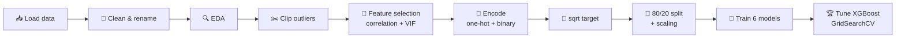
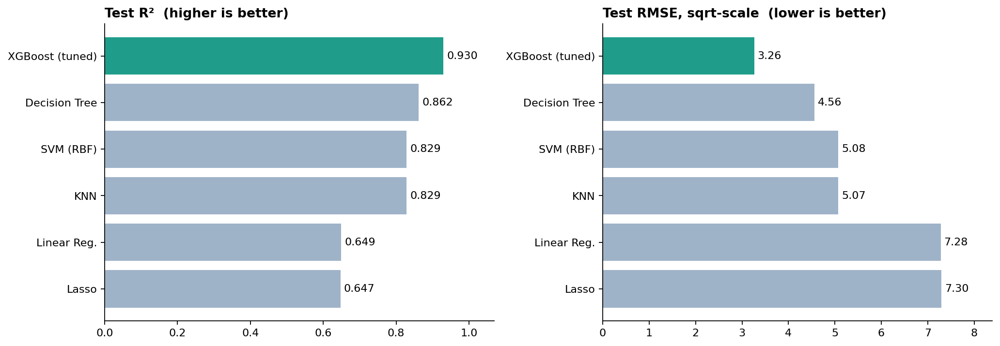
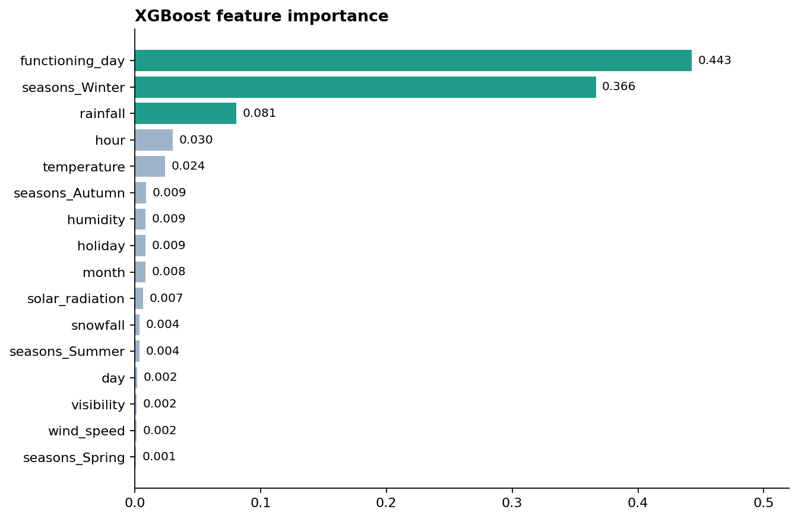

<div align="center">

# 🚲 Seoul Bike Sharing Demand Prediction

**Predicting hourly rental-bike demand in Seoul from weather and calendar data with machine learning.**


[](https://colab.research.google.com/github/dhruvipatel-90/Seoul-Bike-Sharing-Demand/blob/main/Seoul_Bike_Sharing_Demand_Prediction.ipynb)

[Problem](#-problem-statement) · [Dataset](#-dataset) · [Workflow](#-project-workflow) · [Results](#-results) · [Run it](#-how-to-run) · [Structure](#-repository-structure)

</div>

---

## 📌 Problem Statement

Many cities now offer bike rental services to improve urban mobility. Keeping bikes available when people need them reduces waiting time, so a **steady supply** is a key priority, and that depends on knowing how many bikes will be needed **each hour**.

This project forecasts the hourly demand of Seoul's Bike Sharing Program using historical usage together with weather and time information.

<details>
<summary><b>💡 Hypotheses explored (click to expand)</b></summary>

<br>

**🌦️ Weather**
- Does temperature increase rentals (higher demand in pleasant weather)?
- Are rentals lower when humidity is very high?
- Are rentals less frequent during rainfall or snowfall?
- Do windy conditions discourage renting?
- Does low visibility mean fewer rentals?
- Do solar radiation levels (sunny vs cloudy days) influence rentals?

**🕒 Time**
- Are rentals higher at morning and evening commute hours?
- Do people rent more on weekends than on weekdays?
- Are rentals lower on holidays than on working days?
- Do rentals vary across seasons (e.g. highest in summer, lowest in winter)?
- Is late-night behaviour different from daytime behaviour?

</details>

---

## 📊 Dataset

| | |
|---|---|
| **Source** | [UCI Machine Learning Repository: Seoul Bike Sharing Demand](https://archive.ics.uci.edu/dataset/560/seoul+bike+sharing+demand) |
| **Rows × Columns** | 8,760 × 14 (one row per hour for a full year) |
| **Missing values** | none |
| **Duplicate rows** | none |
| **Target** | `Rented Bike Count` |
| **License** | CC BY 4.0 |

The file `SeoulBikeData.csv` is read with `encoding="latin"` because of the `°C` symbol in column names.

<details>
<summary><b>📖 Column descriptions (click to expand)</b></summary>

<br>

| Column | Description |
|---|---|
| Date | day/month/year |
| Rented Bike Count | Bikes rented in that hour (**target**) |
| Hour | Hour of the day (0–23) |
| Temperature (°C) | Temperature in Celsius |
| Humidity (%) | Relative humidity |
| Wind speed (m/s) | Wind speed |
| Visibility (10m) | Visibility in units of 10 m |
| Dew point temperature (°C) | Dew point in Celsius |
| Solar Radiation (MJ/m²) | Solar radiation |
| Rainfall (mm) | Rainfall |
| Snowfall (cm) | Snowfall |
| Seasons | Winter, Spring, Summer, Autumn |
| Holiday | Holiday / No Holiday |
| Functioning Day | Yes (functional hours) / No (non-functional hours) |

</details>

---

## 🔄 Project Workflow



<details>
<summary><b>🧹 1 · Cleaning &amp; pre-processing</b></summary>

<br>

- Renamed columns to snake_case.
- Parsed `Date` (day-first) and split it into `day`, `month`, `year` and `weekday`.
- Built a `session` column (Early Morning, Morning, Afternoon, Evening, Night, Late Night) from `hour`, used for EDA only.

</details>

<details>
<summary><b>🔍 2 · Exploratory data analysis</b></summary>

<br>

Every column was analysed against rented bike count with univariate, bi-variate and multi-variate plots (distribution, point, bar, scatter and line plots), covering all the hypotheses above.

</details>

<details>
<summary><b>✂️ 3 · Outlier treatment</b></summary>

<br>

Skewed continuous features were clipped to the IQR bounds (1.5 × IQR). The target, `rainfall` and `snowfall` were left untouched on purpose, since extreme values there carry real information.

</details>

<details>
<summary><b>🧬 4 · Feature engineering &amp; selection</b></summary>

<br>

- Correlation heatmap → dropped `dew_point_temperature` (highly correlated with temperature).
- Variance Inflation Factor (VIF) check → dropped `year`.
- Dropped the EDA-only columns `weekday` and `session`.
- **Encoding:** `seasons` one-hot encoded; `holiday` and `functioning_day` mapped to 0/1.

</details>

<details>
<summary><b>🎯 5 · Target transformation</b></summary>

<br>

Log, square-root and cube-root transforms were compared; the **square-root** transform was applied to `rented_bike_count`. All reported errors below are therefore on the square-root scale.

</details>

<details>
<summary><b>🧪 6 · Split, scaling &amp; models</b></summary>

<br>

- 80/20 train–test split (7,008 / 1,752 rows, 16 features) followed by `StandardScaler`.
- A reusable `predict()` function trains each model and reports MSE, RMSE, MAE, R² and Adjusted R² for train and test.
- **Models:** Linear Regression · Lasso · KNN (k=3) · SVR (RBF, C=100) · Decision Tree · XGBoost.
- XGBoost was tuned with 5-fold `GridSearchCV` on the training data only.

</details>

---

## 🏆 Results



| Rank | Model | Test RMSE | Test MAE | Train R² | **Test R²** |
|:---:|---|:---:|:---:|:---:|:---:|
| 🥇 | **XGBoost (tuned)** | **3.261** | **2.151** | 0.997 | **0.930** |
| 🥈 | Decision Tree | 4.560 | 3.180 | 0.902 | 0.862 |
| 🥉 | SVM (RBF) | 5.076 | 3.313 | 0.867 | 0.829 |
| 4 | KNN | 5.072 | 3.534 | 0.918 | 0.829 |
| 5 | Linear Regression | 7.279 | 5.600 | 0.654 | 0.649 |
| 6 | Lasso | 7.298 | 5.619 | 0.653 | 0.647 |

<sub>Errors are on the square-root-transformed target.</sub>

**Best XGBoost parameters** (5-fold CV R² = 0.922): `learning_rate=0.05` · `max_depth=8` · `min_child_weight=3` · `n_estimators=500` · `subsample=0.8`

### 🔑 Key takeaways

- **Non-linear models win by a wide margin.** Linear Regression and Lasso reach only ~0.65 R², while XGBoost reaches 0.93, so the link between weather/time and demand is far from linear.
- **Three features dominate XGBoost's importance:** `functioning_day`, `seasons_Winter` and `rainfall` together account for about 89%.
- **The tuned XGBoost overfits somewhat** (train R² 0.997 vs test R² 0.930). Stronger regularisation or early stopping is a natural next step.

<details>
<summary><b>📈 Feature importance chart (click to expand)</b></summary>

<br>



</details>

---

## 🛠️ Tech Stack


---

## 🚀 How to Run

```bash
# 1. Clone the repository
git clone https://github.com/dhruvipatel-90/Seoul-Bike-Sharing-Demand.git
cd Seoul-Bike-Sharing-Demand

# 2. (Recommended) create a virtual environment
python -m venv .venv
.venv\Scripts\activate        # Windows
# source .venv/bin/activate   # macOS / Linux

# 3. Install dependencies
python -m pip install -r requirements.txt

# 4. Open the notebook
jupyter notebook Seoul_Bike_Sharing_Demand_Prediction.ipynb
```

Or skip the setup and click the **Open In Colab** badge at the top. In Colab, upload `SeoulBikeData.csv` and run `!pip install missingno` in the first cell.

---

## 📁 Repository Structure

```
Seoul-Bike-Sharing-Demand/
├── Seoul_Bike_Sharing_Demand_Prediction.ipynb   # full analysis & modelling
├── SeoulBikeData.csv                            # dataset
├── requirements.txt                             # Python dependencies
├── images/
│   ├── model_comparison.png
│   └── feature_importance.png
└── README.md
```

---

## 🙏 Acknowledgements

Dataset: Sathishkumar V E, Jangwoo Park and Yongyun Cho, *"Using data mining techniques for bike sharing demand prediction in metropolitan city"*, Computer Communications, Vol. 153, pp. 353–366, 2020. Hosted by the [UCI Machine Learning Repository](https://archive.ics.uci.edu/dataset/560/seoul+bike+sharing+demand) under CC BY 4.0.

<div align="center">

Made by **[Dhruvi Patel](https://github.com/dhruvipatel-90)** · If you found this useful, a ⭐ is appreciated.

</div>
